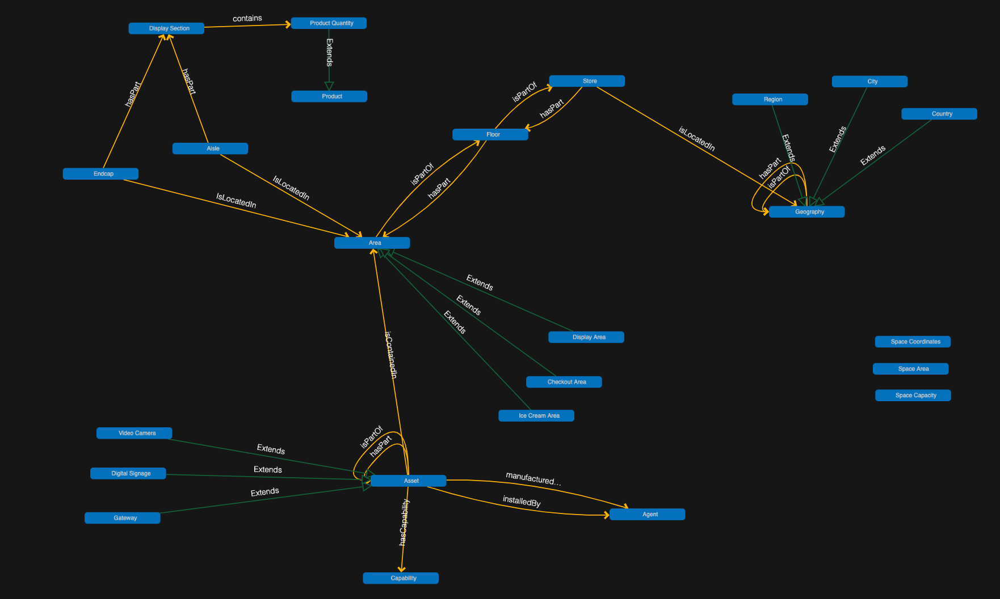

# Digital twin model for retail

This is an example of how to model a retail store in DTDL.

# Structure
- Ontology: DTDL mode
- Overview: Explaination of the modelling

# References

- [RealEstateCore DTDL](https://github.com/falloutxAY/opendigitaltwins-building-retail)
- [ADRM](http://www.adrm.com/)